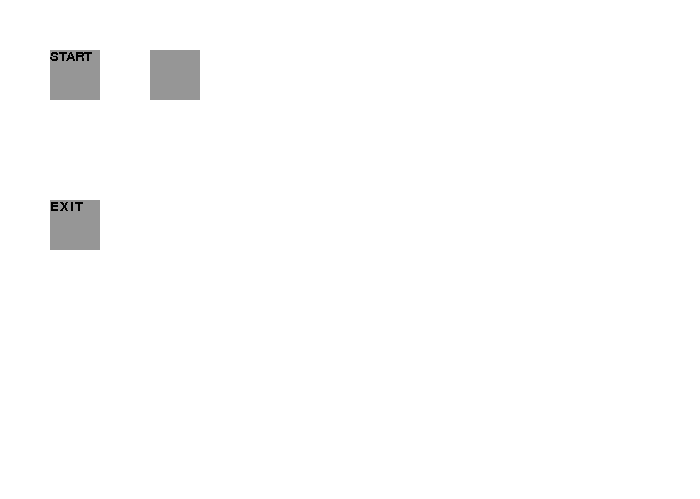

# Mr-Figs
Mr Figs is a turn-based puzzler in the style of good ol' Bomberman.
The player must blast their way through various puzzles to reach the end goal.

####Demo (WIP)

####Requirements

- Python 3.4 
    - Mr Figs will probably run on earlier versions of 3.x but to be safe, I'd use what I'm using.

- Pygame
    - Mr Figs uses the Pygame library for pretty much everything!

####Other libraries
These are already included/not needed but I thought I'd include them just to cover all grounds.

- [Tiled](https://github.com/bjorn/tiled)
    - Mr Figs uses Tiled for all level editing. This helps cut down on boilerplate in the code. In order to parse Tiled's format, I'm using... 

- [PyTMX](https://github.com/bitcraft/PyTMX)
    - Pytmx is a 3rd party library for Tiled map formats. It's pretty neat and I'd recommend it to any sane person using Tiled

####Write-ups
['Undo' Functionality](http://joereynoldsaudio.com/Programming/Articles/undo-in-pygame)

[Building a Level Editor](http://joereynoldsaudio.com/Programming/Articles/building-a-level-editor)
